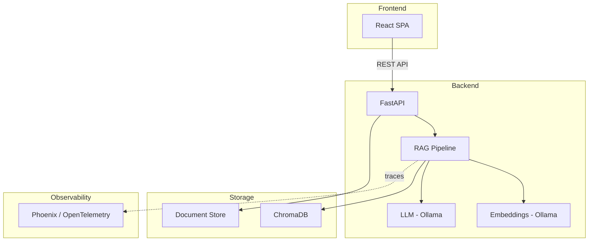

# Phase 4 Research: Frontend & Portfolio

**Phase:** 04 — Frontend UI & Portfolio Artifacts
**Researched:** 2026-03-06
**Researcher confidence:** HIGH (backend API verified from source code, frontend stack from STACK.md, docs fetched for key libraries)

---

## 1. What Are We Building?

A React/TypeScript single-page application that serves as both:
1. **A functional RAG chat interface** — users can ask questions, see answers with citations, upload/manage documents
2. **A portfolio showcase** — demonstrates the full RAG system with evaluation metrics, architecture diagrams, and professional presentation

### Phase Requirements (from REQUIREMENTS.md)

| ID | Requirement | Type |
|----|-------------|------|
| UI-01 | Chat interface with streaming-ready design | Frontend |
| UI-02 | Citations panel showing source chunks | Frontend |
| UI-03 | Confidence indicator (visual) | Frontend |
| UI-04 | Document upload with progress | Frontend |
| UI-05 | Document list with management | Frontend |
| PORT-01 | Architecture diagram (Mermaid) | Portfolio |
| PORT-02 | README with badges, quick start | Portfolio |
| PORT-03 | Evaluation dashboard (HTML or Streamlit) | Portfolio |
| PORT-04 | 2-minute demo video | Portfolio |
| PORT-05 | CI quality gate screenshot | Portfolio |

---

## 2. Backend API Contract (Verified from Source Code)

**Confidence: HIGH** — read directly from `src/ragready/api/routes/*.py` and `src/ragready/generation/models.py`

### 2.1 Endpoints

#### POST /query
```typescript
// Request
interface QueryRequest {
  question: string;
}

// Response (union type)
interface QueryResponse {
  answer: string;
  citations: Citation[];
  confidence: number; // 0.0 - 1.0
  refused: false;
}

interface RefusalResponse {
  refused: true;
  reason: string;
  confidence: number;
  answer: "";
  citations: [];
}

type QueryResult = QueryResponse | RefusalResponse;
```

**Key behaviors:**
- Returns `RefusalResponse` when question is off-topic or unanswerable from documents
- `confidence` is a float 0.0–1.0
- Citations include `chunk_text`, `document_name`, `page_number` (nullable int), `relevance_score` (float)
- No streaming support in current API — design UI to be "streaming-ready" but use standard fetch

#### POST /documents/upload
```typescript
// Request: multipart/form-data with file field
// Accepted types: .pdf, .md, .txt, .html

// Response
interface UploadResponse {
  document_id: string;
  filename: string;
  file_type: string;
  chunk_count: number;
}
```

**Key behaviors:**
- Validates file extension server-side (returns 400 for invalid types)
- Returns chunk_count so UI can show how many chunks were created
- File size limit not explicitly set in code (FastAPI default)

#### GET /documents/
```typescript
// Response
interface DocumentListResponse {
  documents: DocumentInfo[];
  count: number;
}

interface DocumentInfo {
  document_id: string;
  filename: string;
  file_type: string;
  chunk_count: number;
  created_at: string; // ISO datetime
}
```

#### DELETE /documents/{document_id}
```typescript
// Response (200)
interface DeleteResponse {
  deleted: string; // document_id
}
// Error (404): {"detail": "Document not found"}
```

#### GET /health
```typescript
interface HealthResponse {
  status: string;       // "healthy"
  version: string;      // from pyproject.toml
  llm_model: string;    // configured model name
  fallback_model: string | null;
  document_count: number;
  phoenix_enabled: boolean;
}
```

### 2.2 CORS Configuration
```python
allow_origins=["*"]
allow_methods=["*"]
allow_headers=["*"]
```
**No CORS issues expected.** Frontend can run on any port during development.

### 2.3 API Base URL
- Default: `http://localhost:8000`
- Configurable via environment variable in frontend

---

## 3. Technology Stack

**Confidence: HIGH** — from `.planning/research/STACK.md` with versions verified via docs

### 3.1 Core Stack (Decided)

| Technology | Version | Purpose |
|------------|---------|---------|
| React | 19.x | UI framework |
| TypeScript | 5.x | Type safety |
| Vite | 6.x | Build tool / dev server |
| Tailwind CSS | 4.x | Utility-first styling |
| shadcn/ui | latest | Component library (copy-paste, not dependency) |

### 3.2 Additional Libraries (Recommended)

| Library | Purpose | Why This One |
|---------|---------|--------------|
| TanStack Query (React Query) v5 | Server state management | De facto standard for API data fetching in React. Handles caching, refetching, loading/error states, mutations with optimistic updates. Eliminates manual `useEffect` + `useState` patterns. |
| React Router v7 | Client-side routing | Only needed if multi-page (chat vs docs vs dashboard). May be overkill for SPA — evaluate during planning. |
| Lucide React | Icons | Default icon set for shadcn/ui, tree-shakeable, consistent with component library |
| clsx + tailwind-merge | Class name utilities | Required by shadcn/ui's `cn()` utility function |
| Recharts or shadcn/ui charts | Evaluation dashboard charts | Recharts is mature, shadcn/ui has built-in chart components based on Recharts |

### 3.3 shadcn/ui Setup (Verified from Docs)

**Confidence: HIGH** — fetched from official shadcn docs

**Initialization:**
```bash
pnpm dlx shadcn@latest init
```

This will:
1. Create `components.json` configuration file
2. Set up `src/lib/utils.ts` with `cn()` helper
3. Configure path aliases in `tsconfig.json`
4. Install `tailwind-merge` and `clsx` as dependencies

**Adding components:**
```bash
pnpm dlx shadcn@latest add button card input dialog toast tabs badge scroll-area
```

Components are copied into `src/components/ui/` — fully owned, customizable, no version lock-in.

**Key components needed for this project:**
- `Button`, `Input`, `Textarea` — chat interface
- `Card` — citations panel, document cards
- `Badge` — confidence indicator, file type tags
- `Dialog` — upload modal, confirmations
- `Toast` / `Sonner` — success/error notifications
- `ScrollArea` — chat message scrolling
- `Tabs` — switching between chat and documents
- `Progress` — upload progress
- `Skeleton` — loading states
- `Alert` — refusal display

### 3.4 TanStack Query Setup (Verified from Docs)

**Confidence: HIGH** — fetched from official TanStack docs

```typescript
// src/main.tsx
import { QueryClient, QueryClientProvider } from '@tanstack/react-query';

const queryClient = new QueryClient({
  defaultOptions: {
    queries: {
      staleTime: 1000 * 60, // 1 minute
      retry: 1,
    },
  },
});

// Wrap app with <QueryClientProvider client={queryClient}>
```

**Patterns for this project:**

```typescript
// Query: fetching documents list
const { data, isLoading, error } = useQuery({
  queryKey: ['documents'],
  queryFn: () => api.getDocuments(),
});

// Mutation: uploading a document
const uploadMutation = useMutation({
  mutationFn: (file: File) => api.uploadDocument(file),
  onSuccess: () => {
    queryClient.invalidateQueries({ queryKey: ['documents'] });
  },
});

// Mutation: querying the RAG system
const queryMutation = useMutation({
  mutationFn: (question: string) => api.query(question),
});
```

**Why mutation for /query:** The RAG query is not idempotent data fetching — it's a user-initiated action that creates a new conversation turn. `useMutation` gives us `isPending`, `isError`, `data`, and manual trigger via `mutate()`.

---

## 4. Project Structure

**Confidence: HIGH** — based on ARCHITECTURE.md requirements + React/Vite conventions

### 4.1 Directory Layout

```
src/frontend/
├── index.html
├── package.json
├── pnpm-lock.yaml
├── tsconfig.json
├── tsconfig.app.json
├── tsconfig.node.json
├── vite.config.ts
├── tailwind.config.ts         # Tailwind 4.x config (may be CSS-only)
├── components.json             # shadcn/ui config
├── postcss.config.js
├── public/
│   └── favicon.ico
├── src/
│   ├── main.tsx                # Entry point, providers
│   ├── App.tsx                 # Root component, layout
│   ├── index.css               # Tailwind imports, global styles
│   ├── lib/
│   │   ├── utils.ts            # cn() helper (shadcn)
│   │   └── api.ts              # API client (fetch wrappers)
│   ├── types/
│   │   └── api.ts              # TypeScript interfaces matching backend models
│   ├── hooks/
│   │   ├── use-query-rag.ts    # TanStack mutation for /query
│   │   ├── use-documents.ts    # TanStack query/mutations for documents
│   │   └── use-health.ts       # TanStack query for /health
│   ├── components/
│   │   ├── ui/                 # shadcn/ui components (auto-generated)
│   │   ├── chat/
│   │   │   ├── chat-panel.tsx      # Main chat container
│   │   │   ├── message-list.tsx    # Scrollable message history
│   │   │   ├── message-bubble.tsx  # Single message (user or assistant)
│   │   │   ├── chat-input.tsx      # Question input + send button
│   │   │   └── citations-panel.tsx # Expandable citations for a response
│   │   ├── documents/
│   │   │   ├── document-list.tsx       # List of uploaded documents
│   │   │   ├── document-card.tsx       # Single document with delete action
│   │   │   └── upload-dialog.tsx       # File upload with drag-and-drop
│   │   ├── shared/
│   │   │   ├── confidence-badge.tsx    # Color-coded confidence indicator
│   │   │   ├── header.tsx              # App header with health status
│   │   │   └── layout.tsx              # Page layout wrapper
│   │   └── dashboard/
│   │       └── eval-dashboard.tsx      # Evaluation metrics display (if embedded)
│   └── __tests__/              # Component tests
│       ├── chat-panel.test.tsx
│       ├── document-list.test.tsx
│       └── api.test.ts
```

### 4.2 Important: Separate package.json

The frontend is a **separate Node.js project** within the monorepo. It has its own `package.json`, not mixed into Python's `pyproject.toml`. The root project can add npm scripts or a Makefile target to build/serve the frontend.

### 4.3 Tailwind CSS 4.x Note

**Confidence: MEDIUM** — Tailwind 4.x uses a new CSS-first configuration approach.

Tailwind CSS v4 shifted to CSS-based configuration with `@theme` and `@import "tailwindcss"` instead of a JS config file. However, shadcn/ui's init process may still generate a `tailwind.config.ts`. Follow whatever shadcn/ui generates during init — it handles Tailwind 4 compatibility.

Key difference: In Tailwind 4, you may configure in `src/index.css`:
```css
@import "tailwindcss";

@theme {
  --color-primary: oklch(0.65 0.25 260);
  /* custom theme tokens */
}
```

---

## 5. UI Component Design

**Confidence: HIGH** — based on RAG system UX best practices and requirement analysis

### 5.1 Chat Interface (UI-01)

**Layout:** Single-page with sidebar pattern
- **Main area (70%):** Chat messages (scrollable)
- **Sidebar (30%):** Citations panel for selected message + document management tabs

**Chat flow:**
1. User types question in input at bottom
2. Input disables, loading skeleton appears in message area
3. Response arrives → render answer as assistant message
4. If `refused: true` → show refusal message with distinct styling (amber/warning)
5. Citations appear in sidebar automatically for latest message
6. Click any past message to show its citations in sidebar

**Streaming-ready design:**
- Even though current API isn't streaming, design the message rendering to accept progressive text
- Use a `content` state variable that the message bubble reads from
- When streaming is added later, just update that state in chunks

### 5.2 Citations Panel (UI-02)

**For each citation, display:**
- Document name (prominent, as a tag/badge)
- Page number (if available, otherwise "N/A")
- Relevance score (as percentage bar or badge, e.g., "92% relevant")
- Chunk text (collapsible/expandable, show first 200 chars by default)

**Interaction:**
- Citations listed vertically in sidebar
- Sorted by relevance_score descending
- Click to expand full chunk text

### 5.3 Confidence Indicator (UI-03)

**Visual design:** Color-coded badge next to each answer

| Confidence Range | Color | Label |
|-----------------|-------|-------|
| 0.8–1.0 | Green | High Confidence |
| 0.5–0.79 | Yellow/Amber | Medium Confidence |
| 0.0–0.49 | Red | Low Confidence |

**Implementation:** shadcn/ui `Badge` with variant based on confidence range. Simple, clear, no complex visualization needed.

### 5.4 Document Upload (UI-04)

**UX flow:**
1. Click "Upload" button → opens `Dialog` modal
2. Modal has drag-and-drop zone + file picker button
3. Accepted file types: `.pdf`, `.md`, `.txt`, `.html` (match backend validation)
4. Show file name and size before upload
5. Click "Upload" → show `Progress` bar (or indeterminate spinner since we don't get upload progress from fetch API easily)
6. On success → toast notification with chunk count, close dialog, invalidate documents query
7. On error → toast with error message, keep dialog open

**Note on progress:** True upload progress requires `XMLHttpRequest` or `fetch` with `ReadableStream`. For simplicity, use an indeterminate progress indicator (spinner/skeleton). Real progress is a nice-to-have, not required.

### 5.5 Document Management (UI-05)

**Layout:** Grid or list of document cards

**Each document card shows:**
- Filename (truncated if long)
- File type badge (`.pdf`, `.md`, etc.)
- Chunk count
- Created date (formatted)
- Delete button (with confirmation dialog)

**Delete flow:**
1. Click delete → confirmation dialog: "Delete {filename}? This will remove all {chunk_count} chunks."
2. Confirm → mutation fires, optimistic UI removes card
3. On error → card reappears, error toast

---

## 6. API Client Architecture

**Confidence: HIGH** — standard patterns, verified with TanStack Query docs

### 6.1 API Client Module (`src/lib/api.ts`)

```typescript
const API_BASE = import.meta.env.VITE_API_URL || 'http://localhost:8000';

async function fetchApi<T>(path: string, options?: RequestInit): Promise<T> {
  const response = await fetch(`${API_BASE}${path}`, {
    headers: {
      'Content-Type': 'application/json',
      ...options?.headers,
    },
    ...options,
  });
  
  if (!response.ok) {
    const error = await response.json().catch(() => ({ detail: 'Unknown error' }));
    throw new ApiError(response.status, error.detail || 'Request failed');
  }
  
  return response.json();
}

export const api = {
  query: (question: string) =>
    fetchApi<QueryResult>('/query', {
      method: 'POST',
      body: JSON.stringify({ question }),
    }),

  getDocuments: () =>
    fetchApi<DocumentListResponse>('/documents/'),

  uploadDocument: (file: File) => {
    const formData = new FormData();
    formData.append('file', file);
    return fetch(`${API_BASE}/documents/upload`, {
      method: 'POST',
      body: formData,
      // NOTE: Don't set Content-Type header — browser sets it with boundary for multipart
    }).then(handleResponse<UploadResponse>);
  },

  deleteDocument: (documentId: string) =>
    fetchApi<DeleteResponse>(`/documents/${documentId}`, {
      method: 'DELETE',
    }),

  getHealth: () =>
    fetchApi<HealthResponse>('/health'),
};
```

### 6.2 Custom Hooks

Each hook wraps TanStack Query and provides a clean interface:

- **`useQueryRag()`** — returns `{ ask, answer, citations, confidence, isAsking, isRefused, error }`
- **`useDocuments()`** — returns `{ documents, count, isLoading, upload, deleteDoc, isUploading }`
- **`useHealth()`** — returns `{ health, isLoading, isError }` (poll every 30s)

### 6.3 Error Handling Strategy

- **Network errors:** Toast notification + retry button
- **400 errors:** Show validation message from API response
- **404 errors (delete):** Show "document not found" toast, refetch list
- **500 errors:** Show generic error toast with "try again" suggestion
- **No connection:** Health check fails → show banner "API unavailable"

---

## 7. Portfolio Artifacts

**Confidence: HIGH** — requirements are clear, tools are well-documented

### 7.1 Architecture Diagram — PORT-01 (Mermaid)

**Use Mermaid in README.md.** GitHub renders Mermaid natively in markdown.



**Verified:** Mermaid syntax is standard `graph TB` / `flowchart` notation. GitHub Markdown supports fenced code blocks with `mermaid` language tag. No additional tooling needed.

### 7.2 README Enhancement — PORT-02

The README should be **the first thing a hiring manager sees.** Structure:

1. **Hero section:** Project name, one-line description, badges (CI status, Python version, license)
2. **Architecture diagram:** Mermaid (rendered inline)
3. **Key features:** Bullet list with brief descriptions
4. **Quick start:** 5 commands or fewer to get running
5. **Tech stack:** Table with logos/badges
6. **Evaluation results:** Summary table of metrics
7. **Screenshots/demo:** Link to demo video, embedded screenshots
8. **Project structure:** Tree view
9. **API documentation:** Link or brief endpoint table

**CI badge format:**
```markdown

```

### 7.3 Evaluation Dashboard — PORT-03

**Decision: Build as a static HTML page**, not Streamlit.

**Rationale:**
- Streamlit adds a heavy Python dependency for what's essentially a display page
- A static HTML page can be generated from evaluation JSON reports
- Can be served alongside the React app or viewed standalone
- Can embed in README as screenshots

**Implementation approach:**
- Python script (`scripts/generate_dashboard.py`) reads `reports/*.json` and generates `reports/dashboard.html`
- Use a simple HTML template with inline CSS (or Tailwind CDN)
- Show: metric cards, pass/fail indicators, comparison charts (naive vs hybrid), threshold bars
- Alternative: Build as a route within the React app that reads a bundled JSON file

**Metrics to display (from evaluation scripts):**
- Context Recall, Context Precision
- Refusal Accuracy, Citation Accuracy
- Faithfulness, Answer Relevancy (when available)
- Hallucination Rate
- Naive vs Hybrid comparison (retrieval quality improvement)

### 7.4 Demo Video — PORT-04

**Confidence: MEDIUM** — this is a manual task, but planning guidance helps

**Script outline (2 minutes):**
- 0:00–0:15 — Title card, project name, "Production-grade RAG system"
- 0:15–0:45 — Upload a document, show chunk count feedback
- 0:45–1:15 — Ask questions, show answers with citations and confidence
- 1:15–1:30 — Show a refusal (off-topic question)
- 1:30–1:50 — Show evaluation dashboard / CI pipeline passing
- 1:50–2:00 — Architecture diagram, closing

**Tools:** OBS Studio or screen recording. No special software needed.

### 7.5 CI Quality Gate Screenshot — PORT-05

**Simple:** Take a screenshot of GitHub Actions showing all jobs passing with the evaluation quality gate. Include in README.

---

## 8. Testing Strategy

**Confidence: HIGH** — standard React testing patterns

### 8.1 Testing Stack

| Tool | Purpose |
|------|---------|
| Vitest | Test runner (native Vite integration) |
| React Testing Library | Component testing |
| MSW (Mock Service Worker) | API mocking in tests |

**Why Vitest over Jest:** Vitest is the natural choice for Vite projects. Same API as Jest but uses Vite's transform pipeline. Zero extra config needed.

**Why MSW:** Mock the backend API at the network level. Tests exercise real fetch calls, but responses are intercepted. More realistic than mocking fetch or the API client directly.

### 8.2 What to Test

**Must test:**
- Chat input sends question, displays response
- Citations render correctly from API response
- Confidence badge shows correct color for different ranges
- Document upload flow (file selection → API call → success state)
- Document delete flow (confirmation → API call → removal from list)
- Refusal responses render with distinct styling
- Error states display correctly (API errors, network errors)
- API client correctly formats requests and parses responses

**Don't need to test:**
- shadcn/ui component internals (already tested by library)
- Tailwind CSS class application
- Vite build process

### 8.3 Test File Convention

```
src/__tests__/
├── components/
│   ├── chat-panel.test.tsx
│   ├── citations-panel.test.tsx
│   ├── confidence-badge.test.tsx
│   ├── document-list.test.tsx
│   └── upload-dialog.test.tsx
├── hooks/
│   ├── use-query-rag.test.ts
│   └── use-documents.test.ts
├── lib/
│   └── api.test.ts
└── setup.ts                    # MSW server setup, test utilities
```

---

## 9. Development Workflow

### 9.1 Dev Server Setup

```bash
# Terminal 1: Backend
cd src/ragready && uvicorn api.app:create_app --factory --reload --port 8000

# Terminal 2: Frontend
cd src/frontend && pnpm dev    # Vite dev server on port 5173
```

No proxy config needed — CORS is `allow_origins=["*"]`. Frontend fetches directly from `http://localhost:8000`.

### 9.2 Environment Variables

```env
# src/frontend/.env
VITE_API_URL=http://localhost:8000
```

`VITE_` prefix required for Vite to expose env vars to client code via `import.meta.env`.

### 9.3 Build & Serve

```bash
pnpm build          # Outputs to dist/
pnpm preview        # Serve built files locally
```

For production, the `dist/` folder contains static files that can be served by any HTTP server, or potentially served by FastAPI itself using `StaticFiles` mount.

---

## 10. Design Decisions & Tradeoffs

### 10.1 Single Page vs Multi-Page

**Decision: Single page with tab/panel switching.** No React Router needed.

**Rationale:** The app has only 2–3 views (chat, documents, maybe dashboard). Tab switching within a single page is simpler, avoids router complexity, and feels more like a cohesive app. The URL doesn't need to change — this is a demo/portfolio app, not a production web app with deep linking requirements.

### 10.2 State Management

**Decision: TanStack Query for server state. React `useState` for UI state. No Redux/Zustand.**

**Rationale:** All complex state in this app is server state (documents, query results, health). TanStack Query handles this perfectly. The only local state is: current input text, selected message for citations, dialog open/closed. This is trivially handled by `useState`. Adding a state management library would be over-engineering.

### 10.3 Chat History

**Decision: In-memory only (React state). No persistence.**

**Rationale:** This is a portfolio demo, not a production chat app. Chat history in `useState` as an array of `{role, content, citations, confidence}` objects. Refreshing the page clears history — acceptable for a demo. If persistence is desired later, `localStorage` is a trivial addition.

### 10.4 Responsive Design

**Decision: Desktop-first, with basic mobile support via Tailwind breakpoints.**

**Rationale:** Portfolio reviewers will view on desktop. Mobile layout is nice-to-have but not critical. Tailwind makes basic responsiveness easy (sidebar collapses on small screens, stack layout on mobile).

### 10.5 Static Dashboard vs React Route

**Decision: Build evaluation dashboard as a React route within the app, reading from a bundled JSON file.**

**Rationale:** Keeps everything in one app, easier to demo, no separate build step. The evaluation JSON can be generated by CI and committed, or bundled at build time. A `/dashboard` tab in the app shows metrics alongside the working system — more impressive for portfolio.

---

## 11. Common Pitfalls & Mitigations

### 11.1 CRITICAL: File Upload Content-Type Header

**Pitfall:** Setting `Content-Type: application/json` or `Content-Type: multipart/form-data` manually on file upload requests.

**Why it breaks:** When using `FormData`, the browser automatically sets `Content-Type: multipart/form-data` with the correct boundary string. Manually setting it omits the boundary → server can't parse the upload.

**Prevention:** Do NOT set Content-Type header for upload requests. Let the browser handle it.

### 11.2 CRITICAL: TanStack Query Key Consistency

**Pitfall:** Using inconsistent query keys leads to stale cache, failed invalidations.

**Prevention:** Define query keys as constants:
```typescript
export const queryKeys = {
  documents: ['documents'] as const,
  health: ['health'] as const,
};
```
Use these everywhere — in `useQuery`, `useMutation.onSuccess` invalidations, etc.

### 11.3 MODERATE: Tailwind 4 Breaking Changes

**Pitfall:** Tailwind v4 changed configuration from JS to CSS-first. Many tutorials and examples online use v3 syntax.

**Prevention:** Follow shadcn/ui's generated config exactly. If shadcn/ui init generates a `tailwind.config.ts`, use it. Don't mix v3 and v4 configuration patterns. Check the actual version installed.

### 11.4 MODERATE: shadcn/ui Path Aliases

**Pitfall:** shadcn/ui requires `@/` path aliases to resolve to `src/`. If `tsconfig.json` paths aren't configured correctly, imports break.

**Prevention:** The `shadcn init` command configures this. Verify after init:
```json
// tsconfig.json
{
  "compilerOptions": {
    "baseUrl": ".",
    "paths": {
      "@/*": ["./src/*"]
    }
  }
}
```
Also ensure `vite.config.ts` has the matching resolve alias:
```typescript
resolve: {
  alias: {
    "@": path.resolve(__dirname, "./src"),
  },
},
```

### 11.5 MODERATE: CORS Preflight with Custom Headers

**Pitfall:** Adding custom headers (like auth tokens) triggers CORS preflight OPTIONS requests. While the backend allows all origins, misconfigured headers can still cause issues.

**Prevention:** Don't add unnecessary custom headers. The current API has no auth — keep requests simple.

### 11.6 MINOR: Chat Scroll Position

**Pitfall:** New messages don't auto-scroll to bottom, or scroll jumps while user is reading older messages.

**Prevention:** Auto-scroll to bottom when a new message is added, but only if user is already at/near the bottom. Use `scrollIntoView({ behavior: 'smooth' })` on a ref at the bottom of the message list.

### 11.7 MINOR: Large File Upload UX

**Pitfall:** Large PDFs take time to process (embedding generation). User thinks upload failed.

**Prevention:** Show clear loading state after upload succeeds: "Processing document... Creating embeddings for {chunk_count} chunks." Use the `isPending` state from TanStack Query mutation.

---

## 12. Implementation Order Recommendation

Based on dependency analysis, build in this order:

### Wave 1: Foundation (no API needed)
1. Scaffold Vite + React + TypeScript project
2. Install and configure Tailwind CSS
3. Run `shadcn init` and add required components
4. Set up TanStack Query provider
5. Create API client module with TypeScript types
6. Create basic layout (header, main area, sidebar)

### Wave 2: Core Features (needs running backend)
7. Build chat interface (input, message list, message bubbles)
8. Wire up `/query` mutation, handle responses and refusals
9. Build citations panel, wire to selected message
10. Build confidence badge component
11. Build document list, wire to `/documents/` query
12. Build document upload dialog, wire to `/documents/upload` mutation
13. Build document delete flow

### Wave 3: Polish & Testing
14. Add error handling (network errors, API errors, health check banner)
15. Add loading states (skeletons, spinners)
16. Write component tests with Vitest + RTL + MSW
17. Responsive design adjustments

### Wave 4: Portfolio Artifacts
18. Create Mermaid architecture diagram
19. Enhance README (badges, quick start, screenshots)
20. Build evaluation dashboard (React route or static HTML)
21. Record demo video
22. Capture CI quality gate screenshot

---

## 13. Open Questions & Risks

| Question | Impact | Suggested Resolution |
|----------|--------|---------------------|
| Should the evaluation dashboard be a React route or standalone HTML? | Low — either works | React route (recommended in section 10.5) |
| Tailwind v4 CSS-first config: will shadcn/ui handle it correctly? | Medium — could cause setup issues | Follow shadcn/ui init output exactly, test early |
| Should frontend be served by FastAPI in production? | Low — portfolio only | Keep separate; document both options in README |
| Demo video tool/format? | Low — manual task | OBS Studio, MP4, upload to YouTube/Loom |
| How to bundle evaluation JSON into React app? | Low — trivial | Copy to `public/` folder at build time, or import as JSON module |

---

## 14. Source Verification Log

| Claim | Source | Confidence |
|-------|--------|------------|
| API endpoints and models | Direct code read: `src/ragready/api/routes/*.py`, `generation/models.py` | HIGH |
| CORS configured as allow_all | Direct code read: `src/ragready/api/app.py` | HIGH |
| shadcn/ui Vite init process | Official docs (webfetch) | HIGH |
| TanStack Query v5 patterns | Official docs (webfetch) | HIGH |
| Mermaid in GitHub markdown | Official docs (webfetch) + widely known | HIGH |
| Tailwind CSS v4 config approach | Training data + STACK.md version spec | MEDIUM |
| Vitest as test runner for Vite | Widely known, standard practice | HIGH |
| MSW for API mocking | Widely known, standard practice | HIGH |
| React 19 compatibility with above libs | Training data | MEDIUM |
