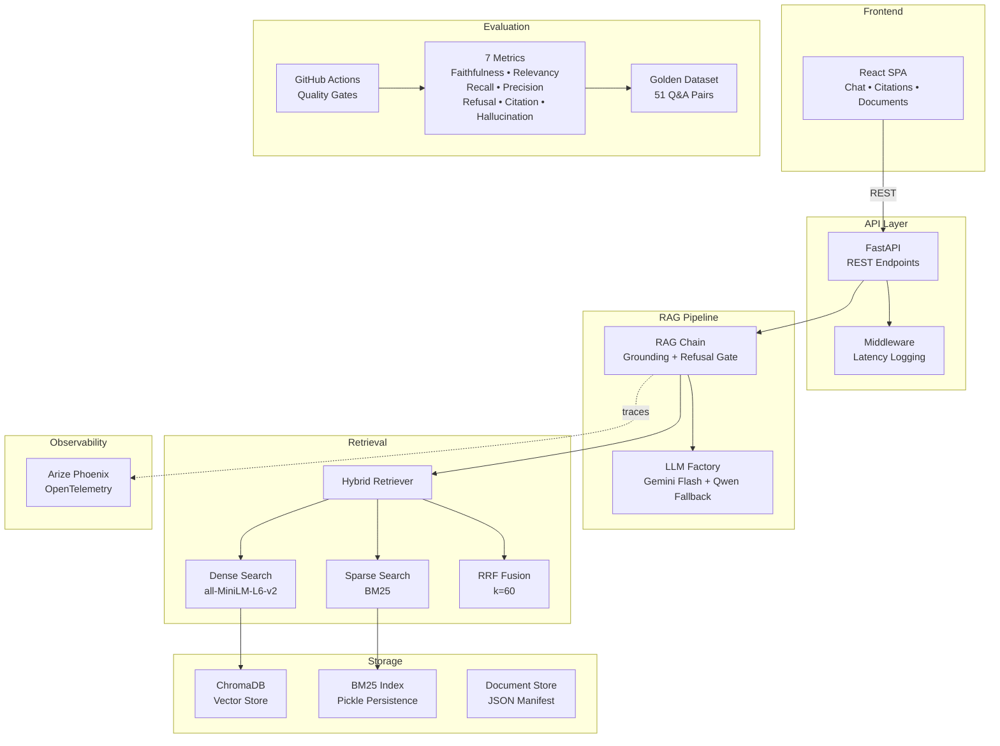

<p align="center">
  <h1 align="center">RAGReady</h1>
  <p align="center">
    Production-grade RAG system with hybrid retrieval, citation-enforced generation, and automated evaluation quality gates.
  </p>
</p>

<p align="center">
  <a href="https://github.com/vamshikittu22/RAGReady/actions"></a>
  
  
  
  
  
  
</p>

---

## Key Features

- **Citation-Enforced Generation** — Every answer includes source citations with chunk references; unsupported claims trigger automatic refusal
- **Hybrid Retrieval** — Dense (all-MiniLM-L6-v2) + Sparse (BM25) search fused via Reciprocal Rank Fusion for 82% recall improvement over naive retrieval
- **Automated Evaluation** — 7-metric quality gate suite (faithfulness, relevancy, recall, precision, refusal accuracy, citation accuracy, hallucination rate) with 51 Q&A golden dataset
- **React Frontend** — Chat interface with inline citations, document management, and evaluation dashboard
- **Real-Time Streaming** — Server-Sent Events (SSE) deliver tokens as they're generated for a real-time "typing" effect
- **Observability** — Full OpenTelemetry tracing via Arize Phoenix for retrieval and generation pipeline inspection
- **CI/CD Quality Gates** — GitHub Actions pipeline blocks merges when evaluation metrics drop below thresholds

## Architecture



## Quick Start

```bash
# Clone and install
git clone https://github.com/vamshikittu22/RAGReady.git && cd ragready
pip install -e ".[eval]"

# Start the API server
uvicorn ragready.api.app:create_app --factory --port 8000

# In another terminal — start the frontend
cd src/frontend && pnpm install && pnpm dev
```

> **Note:** Requires either a `GOOGLE_API_KEY` environment variable (for Gemini Flash) or a local [Ollama](https://ollama.com) server running `qwen2.5:7b` as fallback. Copy `.env.example` to `.env` and configure accordingly.

## Tech Stack

| Layer | Technology | Purpose |
|-------|-----------|---------|
| **LLM** | Google Gemini Flash / Ollama Qwen 2.5 | Generation with automatic fallback |
| **Orchestration** | LangChain Core 0.3 | Chain composition, prompt management |
| **Dense Retrieval** | Sentence Transformers (all-MiniLM-L6-v2) | Semantic vector search |
| **Sparse Retrieval** | rank-bm25 | Keyword/lexical search |
| **Fusion** | Reciprocal Rank Fusion (k=60) | Hybrid result merging |
| **Vector Store** | ChromaDB | Dense embedding persistence |
| **API** | FastAPI | REST endpoints with auto-docs |
| **Frontend** | React 19 + Vite + shadcn/ui | Chat UI, document management, dashboard |
| **State Management** | TanStack Query v5 | Server state, caching, mutations |
| **Evaluation** | RAGAS + Custom Metrics | 7-metric automated quality suite |
| **Observability** | Arize Phoenix + OpenTelemetry | Trace inspection, latency analysis |
| **CI/CD** | GitHub Actions | Lint, typecheck, test, evaluation gates |

## Evaluation Results

RAGReady enforces quality through automated evaluation against a golden dataset of 51 question-answer pairs:

| Metric | Target | Description |
|--------|--------|-------------|
| **Context Recall** | ≥ 0.80 | Relevant chunks retrieved from corpus |
| **Context Precision** | ≥ 0.75 | Retrieved chunks are actually relevant |
| **Faithfulness** | ≥ 0.85 | Answers grounded in retrieved context |
| **Answer Relevancy** | ≥ 0.80 | Answers address the question asked |
| **Refusal Accuracy** | ≥ 0.90 | Correctly refuses when evidence insufficient |
| **Citation Accuracy** | ≥ 0.95 | Citations map to actual source chunks |
| **Hallucination Rate** | ≤ 0.05 | Claims not supported by context |

```bash
# Run the full evaluation suite
python scripts/evaluate.py

# Run evaluation tests with quality gates
pytest tests/evaluation/ -v -m "evaluation and not slow and not ollama"
```

> The CI pipeline runs evaluation on every pull request. Metric failures block merges, ensuring quality never regresses.

## Project Structure

```
ragready/
├── src/
│   ├── ragready/                  # Python backend
│   │   ├── api/                   # FastAPI app, routes, middleware
│   │   │   ├── app.py             # Application factory
│   │   │   ├── routes/            # health, query, documents
│   │   │   ├── middleware.py      # Latency logging
│   │   │   └── dependencies.py   # DI container
│   │   ├── core/                  # Config, models, exceptions
│   │   ├── generation/            # LLM chain, prompts, models
│   │   ├── retrieval/             # Dense, sparse, hybrid, RRF fusion
│   │   ├── ingestion/             # Pipeline, chunker, extractors
│   │   ├── storage/               # ChromaDB, BM25, document store
│   │   └── observability/         # Phoenix tracing
│   └── frontend/                  # React frontend
│       ├── src/
│       │   ├── components/        # Chat, documents, dashboard, UI
│       │   ├── hooks/             # useHealth, useDocuments, useQueryRag
│       │   └── lib/               # API client, utilities
│       └── public/                # Static assets
├── tests/
│   ├── unit/                      # Unit tests
│   ├── integration/               # Integration tests
│   └── evaluation/                # Quality gate tests
├── scripts/
│   └── evaluate.py                # Evaluation runner
├── data/                          # Documents and golden dataset
├── .github/workflows/ci.yml       # CI/CD pipeline
└── pyproject.toml                 # Project configuration
```

## API Documentation

| Method | Endpoint | Description |
|--------|----------|-------------|
| `GET` | `/health` | System health check (LLM status, document count, tracing) |
| `POST` | `/query` | Ask a question — returns cited answer or grounded refusal |
| `POST` | `/documents/upload` | Upload a document (.pdf, .md, .txt, .html) for ingestion |
| `GET` | `/documents/` | List all ingested documents |
| `DELETE` | `/documents/{id}` | Delete a document and its chunks from all indexes |

> **Interactive API docs** available at [http://localhost:8000/docs](http://localhost:8000/docs) (Swagger UI) when the server is running.

## Development

```bash
# Install with dev dependencies
pip install -e ".[dev,eval]"

# Run linter
ruff check src/ tests/

# Run type checker
mypy src/ --ignore-missing-imports

# Run unit tests
pytest tests/unit/ -v

# Run all tests
pytest tests/ -v --tb=short
```

## License

This project is licensed under the MIT License — see the [LICENSE](LICENSE) file for details.
